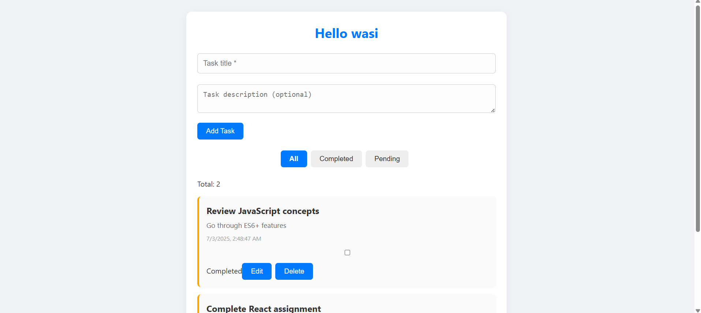
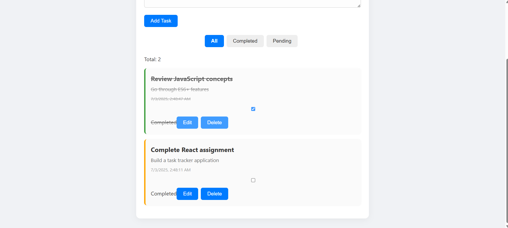

# Personal Task Tracker

## 📖 Description

A simple and clean personal task management app built with React.js. This project allows users to log in with a username, add/edit/delete tasks, mark them as completed, and filter tasks based on status. All task data is saved in localStorage so it persists across refreshes.

##  Features

-  Simple login using localStorage
-  Add new tasks with title and optional description
-  Mark tasks as completed or pending
-  Edit task title and description inline
-  Delete tasks with confirmation
-  Display task creation date/time
-  Filter tasks: All | Completed | Pending
-  Persistent data using browser localStorage
-  Responsive layout for mobile and desktop
-  Modern UI with clean CSS styling


##  Technologies Used
- React.js
- React Hooks (useState, useEffect)
- Browser localStorage API
- CSS for custom styling


## 🖼 Screenshots

### 🏠 Task Dashboard  


### 📝 All Task  



## 🛠 Setup Instructions

1. **Clone the repository**

   ```bash
   git clone 
   cd personal-task-tracker
   Run `npm install`
   Run `npm start`
   Open [http://localhost:3000](http://localhost:3000)
